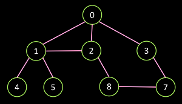

# Nome do projeto
Criação de um sistema de grafos orientado por objetos, para manipulação das operações básicas de um grafo.

## Correção e comentários

### Nota: 5,8

Grafo de teste

---

- README não continha nem o sumário do projeto ali em cima. Eu que coloquei.
- Se não sabemos usar exceção, não usamos: qual a vantagem de criar uma Exception se o método ddo BufferedWritee já lançava IOException?
- BFS e DFS deveriam retornar um grafo/árvore, não void
- Main não contém nada além da criação de um cmpleto
- Também só há um teste mínimo de grafo completo
- Por algum motivo, criaram um "arestas" nas classes filha (já tinha na mãe) e não inicializaram: o teste não consegue nem adicionar uma aresta
- Sem implementação de Grafos Mutáveis concretos, ou seja: não consigo testar nada
- **CORREÇÃO FEITA POR INSPEÇÃO DE CÓDIGO: máximo de 60% da nota**

---

- Aderência e implementação das classes do diagrama: 1/2 pontos
  - Retorno das buscas;
  - Classes não implementadas
- Requisitos de grafos corretamente implementados: 2,6/12 pontos
  - Carregar/salvar		0,6/2 pontos (só salva)
  - Grafo completo e subgrafo 0,6/3 pontos (completo só na filha e não tem subgrafo)
  - Grafo direcionado/não direcionado 0/2 pontos
  - Busca em largura e profundidade 1,2/4 pontos (parecem apenas visitar, sem criar um grafo.)
  - App para uso 0,2/1 ponto
- Documentação de código: 2/4 pontos
  - GrafoCompleto sem documentação. Documentação declarativa no Grafo. Grafo Mutável ok.
- Testes (quantidade e qualidade): 0,2/2 pontos
    - Observação acima

## Alunos integrantes da equipe

* Guilherme Drumond Silva
* Giovanni Bogliolo Sirihal Duarte
* Pedro Ramos Vidigal
* Samuel Lincoln de Oliveira Gomes

## Professores responsáveis

* João Caram

